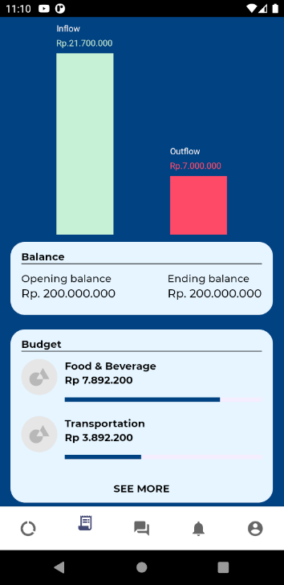
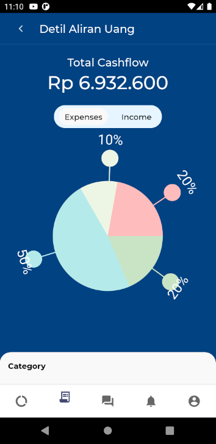

# Bagan

A charting library for react. Bagan aimed to be a minimal dependency library. It only depends on `react-native-svg`.

I started this library during my internship at PT. Teknologi Komersial Asia because there are no premade library that match our needs.

## Setup

Install `react-bagan`

```
yarn add react-bagan
# or
npm install react-bagan
```

Install peer dependency

```
yarn add react-native-svg
# or
npm install react-native-svg
```

## Features

- [x] Vertical Bar Chart



- [x] Spike Pie Chart



- [x] Date Line Chart


- [ ] ???

## Disclaimer

Expect a lot of breaking changes

## License

Licensed under [MIT License](LICENSE)
